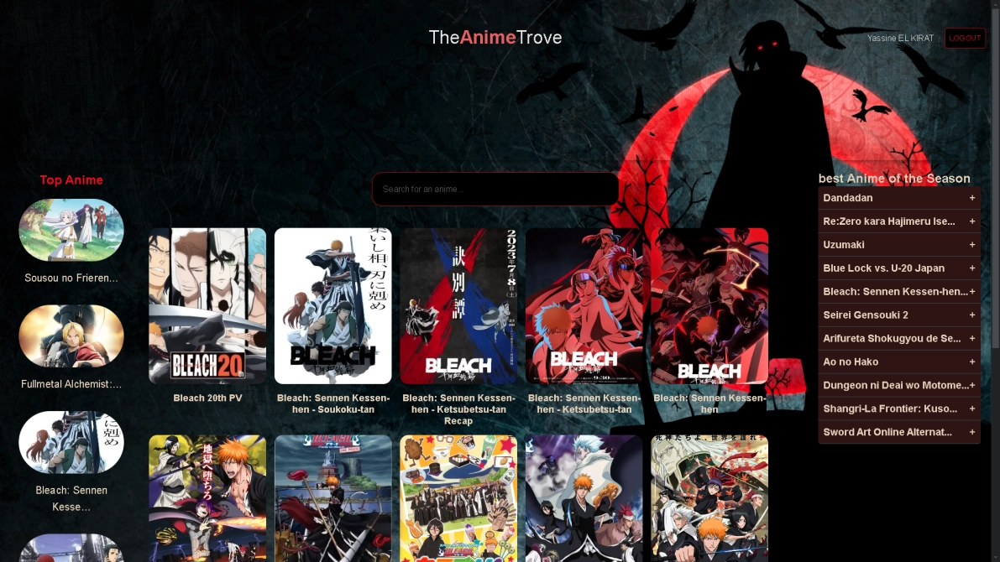

## 🎌 TheAnimeTrove 🎌

Welcome to TheAnimeTrove, a React-based web app where users can search and discover anime from the Jikan API (an unofficial MyAnimeList API). Explore timeless anime or search for your favorites!

## 📜 Table of Contents
Project Overview
Features
Project Architecture
Technologies Used
Setup Instructions
Usage Guidelines
Contributing
License
📖 Project Overview
TheAnimeTrove provides anime enthusiasts with:

🏆 A curated list of top timeless anime.
🔍 A search function to discover new or classic anime by keywords.
📜 Anime details: Links to anime profiles on MyAnimeList.
## ✨ Features
Anime Search: Search for anime using the search bar.
Anime List: Display a list of popular timeless anime with cover images.
Responsive Design: Fully responsive, adapting to all screen sizes.
Styled Components: With SCSS, animations, and hover effects.
🏗️ Project Architecture
## Frontend
React: Core UI developed with React.
Main Components:
Sidebar.js: Displays timeless anime with images and titles.
MainContent.js: Contains the search functionality and lists search results.
AnimeCard.js: Component for each anime result.
Backend (API)
The app relies on the Jikan API, a RESTful service that provides anime data from MyAnimeList.

## 💻 Technologies Used

React: For the user interface and components.
SCSS: Used for styles, animations, and hover effects.
Webpack: Bundles dependencies and optimizes assets.
Jikan API: Provides anime data, fetching data asynchronously.
## ⚙️ Setup Instructions
Prerequisites
Node.js (v12 or higher) and npm must be installed.
Installation Steps
Clone the repository:
bash
Copy code
git clone https://github.com/your-username/TheAnimeTrove.git
Navigate into the project directory:
bash
Copy code
cd TheAnimeTrove
Install all dependencies:
bash
Copy code
npm install
Start the development server:
bash
Copy code
npm start
Visit http://localhost:3000 in your browser.
🛠️ Usage Guidelines
Searching Anime: Use the search bar to look up anime by name. Results will appear dynamically.
Viewing Anime Details: Click on any anime to view more information via MyAnimeList.
🤝 Contributing
We welcome contributions from the community!

📝 License
This project is licensed under the MIT License.